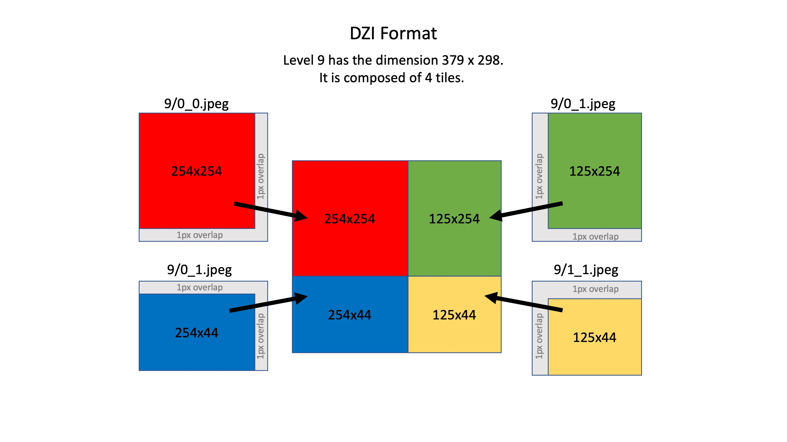

Introduction
============

This script is to proxy a SVS as a DZI file for openseadragon.

Quick start
===========
0. Install these Python dependencies: flask, flask_cors, imagecodecs, requests, opencv
1. Start the local proxy: `python app.py -p 9000`
2. Modify `tileSources` in the `openseadragon` script.
   Serve SVS to openseadragon as a DZI file. 
       In the openseadragon `tileSources`, use a fake DZI file `dummy.dzi` and arguments
          `file` for local SVS files and
          'url` for remote SVS files. 
    
    Scenario 1: to serve a SVS, "abc/abc.svs", specify the following:

            OpenSeadragon({
            id:            "example-xmlhttprequest-for-dzi",
            tileSources:   "http://localhost:9000/proxy/svs/dummy.dzi?file=abc%2Fabc.svs",
        });
    Here `abc/abc.svs` is the relative path to `app.py` and `localhost:9000` is the proxy server (see Step 1.).

    Scenario 2: to serve a SVS, "http://localhost:8000/abc/abc.svs", specify the following:

            OpenSeadragon({
            id:            "example-xmlhttprequest-for-dzi",
            tileSources:   "http://localhost:9000/proxy/svs/dummy.dzi?url=http%3A%2F%2Flocalhost%3A8000%2Fabc%2Fabc.svs",
        });
    Here `http%3A%2F%2Flocalhost%3A8000%2Fabc%2Fabc.svs` is the encode URL for `http://localhost:8000/abc/abc.svs`. `http://localhost:8000` is a web server that support CORS and byte range reading (see Note below for a simple Python3 based web server). `localhost:9000` is the proxy server (see Step 1.).

    Note: here we use `http://localhost:8000` by running: `python byte.server.py`. This is CORS-enabled, byte-range enabled simple HTTP server. 

Reference
=========

jpstroop/dzi_to_iiif.py

https://gist.github.com/jpstroop/4624253

The DZI File Format

https://github.com/openseadragon/openseadragon/wiki/The-DZI-File-Format

DZI format

Suppose a file name is `XXX.dzi`. In DZI format, it has accompany folder `XXX_files/`. 
Under it, there are a series of levels, e.g., `XXX_files/0`, `XXX_files/1`, `XXX_files/2`, et al. 
Under each folder, there are many JPEG files, e.g., `XXX_files/17/0_0.jpeg`, `XXX_files/17/0_1.jpeg`, `XXX_files/17/1_0.jpeg`, et al. The file names are `{tile_column_index}_{tile_row_index}.jpeg`.
The tile size is specified in the XML file `XXX.dzi`. Usually tile size is `254`. That means that the JPEG files have the size `255 x 255` unless they are on the right boundary or bottom boundary.

Let's see an example. A large slide has the dimension: `Height="76282"` and `Width="96976"`: 

| Level | Width | Height | # column tiles | # row tiles | width of the rightmost tile | height of the bottom tile | # jpeg files | bottom right tile |
|------:|------:|-------:|---------------:|------------:|----------------------------:|--------------------------:|-------------:|------------------:|
| 17    | 96976 | 76282  | 382            | 301         | 203                         | 83                        | 114982       |   17/381_300.jpeg |
| 16    | 48488 | 38141  | 191            | 151         | 229                         | 42                        | 28841        |   16/190_150.jpeg |
| 15    | 24244 | 19071  | 96             | 76          | 115                         | 22                        | 7296         |     15/95_75.jpeg |
| 14    | 12122 | 9536   | 48             | 38          | 185                         | 139                       | 1824         |     14/47_37.jpeg |
| 13    | 6061  | 4768   | 24             | 19          | 220                         | 197                       | 456          |     13/23_18.jpeg |
| 12    | 3031  | 2384   | 12             | 10          | 238                         | 99                        | 120          |      12/11_9.jpeg |
| 11    | 1516  | 1192   | 6              | 5           | 247                         | 177                       | 30           |       11/5_4.jpeg |
| 10    | 758   | 596    | 3              | 3           | 251                         | 89                        | 9            |       10/2_2.jpeg |
| 9     | 379   | 298    | 2              | 2           | 126                         | 45                        | 4            |        9/1_1.jpeg |
| 8     | 190   | 149    | 1              | 1           | 190                         | 149                       | 1            |        8/0_0.jpeg |
| 7     | 95    | 75     | 1              | 1           | 95                          | 75                        | 1            |        7/0_0.jpeg |
| 6     | 48    | 38     | 1              | 1           | 48                          | 38                        | 1            |        6/0_0.jpeg |
| 5     | 24    | 19     | 1              | 1           | 24                          | 19                        | 1            |        5/0_0.jpeg |
| 4     | 12    | 10     | 1              | 1           | 12                          | 10                        | 1            |        4/0_0.jpeg |
| 3     | 6     | 5      | 1              | 1           | 6                           | 5                         | 1            |        3/0_0.jpeg |
| 2     | 3     | 3      | 1              | 1           | 3                           | 3                         | 1            |        2/0_0.jpeg |
| 1     | 2     | 2      | 1              | 1           | 2                           | 2                         | 1            |        1/0_0.jpeg |
| 0     | 1     | 1      | 1              | 1           | 1                           | 1                         | 1            |        0/0_0.jpeg |

To understand how tiles are stitched together, see
.